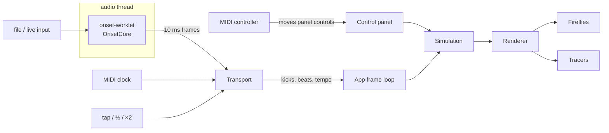

# Sound Toy

An audio-reactive particle instrument. A disc or globe of 1,200–2,800 particles opens from a packed solid
into a cloud, pulses on the kick, spins in time with the music and is disturbed by an orbiting moon. It
listens to live audio, an audio file or Ableton's MIDI clock, and can be played from a MIDI controller.

By **Lenny Ford, [Len Studio](https://len.studio)**. MIT licensed. If you use or adapt it, please credit
"Sound Toy by Lenny Ford (len.studio)".

## Running it

Requires Node 20.19 or later.

```sh
npm ci                # install (see .npmrc for why peer auto-install is off)
npm run dev           # dev server with hot reload
npm run build         # static site → dist/ (for labs.len.studio)
npm run build:single  # one self-contained index.html → dist-single/ (runs from disk)
npm run check         # typecheck + lint + tests
```

Live input and MIDI need a secure context: `localhost`, HTTPS, or the single-file build opened from disk
in Chrome or Edge. Safari has no Web MIDI.

## Using it

| Control     | What it does                                                                   |
| ----------- | ------------------------------------------------------------------------------ |
| State       | Solid ↔ cloud. Kicks push it toward cloud by the Depth amount.                 |
| Shape       | Disc or globe. The globe spins on a 23.4° axis, leaned toward you.             |
| Spin, Orbit | One revolution / orbit per 32 bars … 1 beat, locked to the current tempo.      |
| Physics     | Gas, water, or the pointer and moon as opposite / like magnetic poles.         |
| Source      | Off, demo kick (100 BPM), audio file, or live input.                           |
| Tempo       | Detected tempo and its source. Tap, ½, ×2; Auto clears overrides.              |
| Pulse       | Pulse on detected kicks, or on the beat grid (predicted, so it lands on time). |
| Mode        | Day, or night: neon particles that blink like fireflies over a dusk sky.       |

Keyboard: **H** hide controls, **N** night, **T** tap tempo.

### Audio sources

- **USB mixer or audio interface**: choose it under Live input. Browsers read the first two channels, so
  send the master to channels 1–2. Browser voice processing (echo cancellation, noise suppression, gain
  control) is switched off.
- **Computer audio or Ableton**: route it through a loopback device (BlackHole on macOS, VB-Audio Cable
  on Windows) and choose that device. On macOS a Multi-Output Device keeps your speakers playing too.
- **Ableton tempo, exactly**: enable the IAC Driver (macOS), turn on **Sync** for it in Live's
  Link, Tempo & MIDI settings, then press MIDI **Connect**. MIDI clock takes priority over audio
  detection; audio still provides the kicks.

### MIDI controllers

Controls are mapped from data in [`src/midi/profiles.ts`](src/midi/profiles.ts). The Akai MPK mini
profile assumes knobs 1–5 on CC 70–74 (State, Spin, Orbit, Force, Depth) and pads 1–8 on notes 36–43
(the four physics modes, a velocity-sensitive kick, and Shape / Moon / Demo toggles). If a unit's preset
differs, Map fixes it. **Map** reassigns any
control: click it, then move a knob or hit a pad. Maps are saved per browser.

To add a controller, add a profile with a regular expression that matches its MIDI port name and its
factory CC and note numbers.

## Architecture



| Module                      | Responsibility                                                                            |
| --------------------------- | ----------------------------------------------------------------------------------------- |
| `audio/onset-core.ts`       | Samples → band onset strengths at 100 frames/s (kick < 120 Hz, mids, highs).              |
| `audio/onset-worklet.ts`    | Runs OnsetCore on the audio thread; inlined at build time and loaded from a Blob URL.     |
| `audio/tempo-tracker.ts`    | Tempo, beat phase and kick detection (below).                                             |
| `audio/transport.ts`        | Single source of truth for tempo: MIDI clock > tap / demo > detection. Emits kicks/beats. |
| `audio/audio-engine.ts`     | AudioContext and sources: synthesised demo kick, looping file, live input.                |
| `audio/midi-clock.ts`       | 24 ppqn clock → tempo (least-squares fit) and beats, with Start and Song Position.        |
| `sim/simulation.ts`         | Fixed-step particle physics, globe spin, shockwaves, pointer and moon forces.             |
| `render/renderer.ts`        | Canvas 2D: depth bands, moon occlusion, day dots, night additive glow.                    |
| `midi/midi-controller.ts`   | Web MIDI input, mapping and Map mode.                                                     |
| `ui/controls.ts`, `main.ts` | Panel bindings and the composition root / frame loop.                                     |

The tempo code (`onset-core`, `tempo-tracker`, `midi-clock`, `tap-tempo`) has no browser dependencies,
so the test suite runs it directly in Node on synthetic audio.

### Tempo tracking

Built for electronic and ambient music, where the kick is the most reliable beat marker.

1. **Onsets.** Each 10 ms frame's energy in three bands is log-compressed and differenced. Energies are
   floored 30 dB under each band's recent peak, so noise and silence don't produce onsets.
2. **Kicks.** A kick is the kick band's 20 ms energy jumping ~7 dB above its previous 150 ms.
3. **Tempo.** Every 0.5 s, the last 10 s of onsets is autocorrelated and scored as a comb over the beat
   and its first three multiples, weighted by a log-normal prior around 120 BPM. The same comb runs on the
   train of detected kicks, so a quiet kick under a loud pad still sets the tempo. The periodicity bar
   rises for shorter windows, and the first lock (like any tempo change) needs two agreeing estimates.
4. **Beat clock.** A phase-locked loop driven by kicks keeps the grid on the beat. Its period is refined by
   a least-squares fit through matched beats, which resolves tempo far below the 10 ms frame grid. A phase
   comb every 0.5 s catches the grid sitting on the off-beat. Through breakdowns the clock keeps running.
5. **Timing.** Frames are timed on the audio clock and mapped to the moment they're heard
   (`getOutputTimestamp` for files, minus input latency for live audio), so visuals land on the beat.

Results on the synthetic suite (`tests/tempo-tracker.test.ts`):

| Material                                   | Result                                                                 |
| ------------------------------------------ | ---------------------------------------------------------------------- |
| House 124, techno 132, 122.5, downtempo 87 | Tempo within 0.15 BPM by ~5 s; beat clock within 15 ms; ≥ 95% of kicks |
| 8 s breakdown                              | Tempo held within 0.1 BPM                                              |
| 124 → 128 change                           | Re-locked within 8 s, settles on exactly 128                           |
| Dubstep 140, drum and bass 174             | Read at half tempo (70, 87); ×2 restores tempo and phase               |
| Quiet kick under a loud pad (8 seeds)      | 75 BPM found, though locking can take up to ~25 s                      |
| Beatless pad (8 seeds)                     | No tempo reported                                                      |

Known limits: half-time genres read at half speed until ×2 is pressed (the setting sticks until Auto).
Real recordings will be harder than synthetic ones; MIDI clock is the exact option when playing from Ableton.

### Simulation and rendering

- Particles have a home position on a phyllotaxis disc and a Fibonacci sphere; the shape morphs between
  them. Opening toward cloud weakens the home springs, scatters the homes and hands over to each mode's
  forces: a thermostat for gas, cohesion and viscosity for water, gaussian-reach poles for the magnets.
- Pair interactions use a uniform grid on x/y with true 3D distances, scanning half the neighbourhood.
- The moon's effect on fluids is potential flow around a moving sphere plus a bow-wave pressure term.
- Physics runs in fixed 1/60 s steps (up to three per frame) and constants are scaled to the shape's
  on-screen size, so behaviour doesn't change with the window.
- Night mode draws additive glow sprites. Base brightness is normalised by sprite overlap so a packed
  solid glows instead of clipping to white. Trails are budgeted to ~400 particles and batched by colour
  and brightness, about 50 strokes per frame.

## Credit and licence

MIT © 2026 Lenny Ford, Len Studio. See [LICENSE](LICENSE). If you use or adapt Sound Toy, please credit
"Sound Toy by Lenny Ford (len.studio)".
